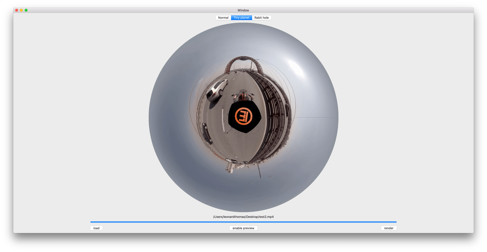
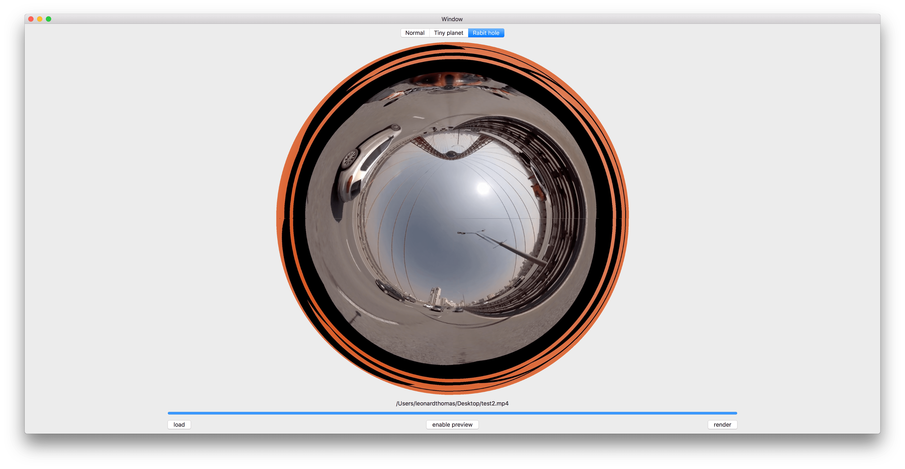

# Tiny Planet

a mac app to converts videos to [azimuthal](https://en.wikipedia.org/wiki/Azimuthal_equidistant_projection) videos (also known as Tiny Planet or Rabbit hole) which can be displayed without distortion on a spheric screen 

# Usage 

The video should have a resolution ratio of 2:1 to get the best results

___
Thanks to [a2](https://github.com/a2) who helped me with a crashing bug

